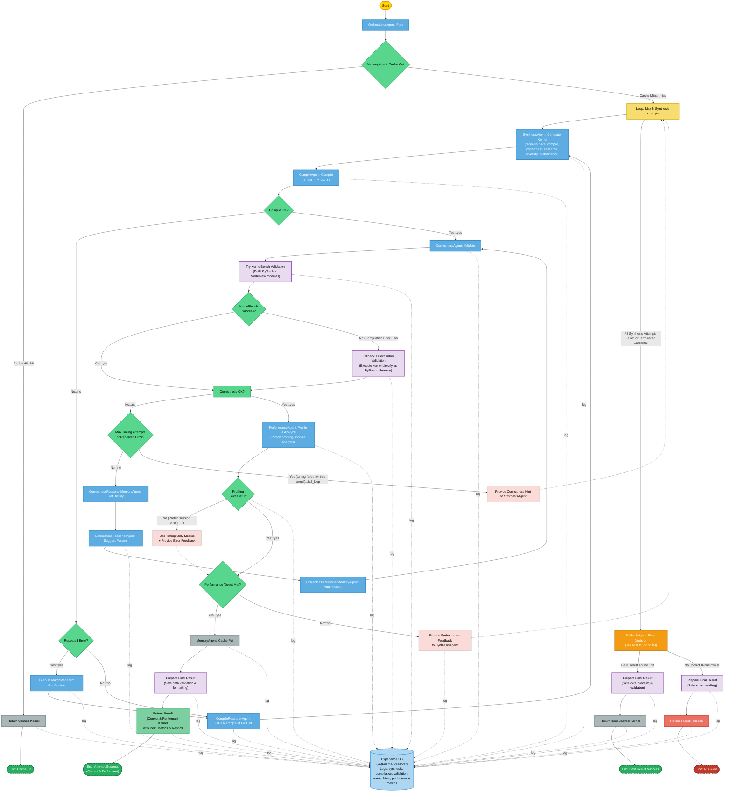

# Project Daniel – Triton-Driven Kernel Synthesis Pipeline

**Table of contents**
1. [Overview](#overview)
2. [Repository structure](#repository-structure)
3. [Triton version compatibility](#triton-version-compatibility)
4. [Installation & setup](#installation--setup)
5. [Agents & orchestration flow](#agents--orchestration-flow)
6. [Running KernelBench](#running-kernelbench)
7. [End-to-end example](#end-to-end-example)
8. [Troubleshooting](#troubleshooting)

---

## Overview
This workspace demonstrates a *self-refining GPU-kernel pipeline* built
around **Triton 2/3**.  A set of cooperating **agents** iteratively
synthesize, compile, benchmark and reason about Triton kernels for tasks
originating from [KernelBench](https://github.com/openai/kernelbench).

The whole stack is coded in Python and requires **no C/CUDA
boiler-plate** – Triton and a few LLM endpoints do the heavy lifting.



**Note:** All agent interactions, decisions, and outcomes in the flow above are logged to a persistent SQLite "Experience Database" (`data/kernel_pipeline_observations.sqlite`) for analysis and to enable future learning capabilities.

## Repository structure
```
Project_daniel/
├─ agents/                 # Autonomous building blocks (LLM, compile …)
│  ├─ base.py              # Common utilities
│  ├─ compile/agent.py     # Kernel → PTX/JIT compiler
│  ├─ correctness/agent.py # Execute unit/perf checks
│  ├─ reasoner/agent.py    # Produce hints when compilation fails
│  ├─ synthesis/agent.py   # LLM-driven kernel generator
│  ├─ observers.py         # Data logging component (e.g., to SQLite)
│  └─ …
│
├─ utils/                 # Logging, dataclasses, GenAI client, …
├─ data/                  # Directory for persistent data, e.g., SQLite DBs
│  └─ kernel_pipeline_observations.sqlite # Database of all pipeline events
├─ KernelBench/           # Upstream benchmark suite (git-subtree)
├─ rc.py                  # Stand-alone compiler helper (shows fallbacks)
├─ run_kernelbench.py     # CLI: run pipeline over KernelBench levels
├─ tmp_* directories      # Auto-saved payloads, sources, outputs
└─ requirements.txt       # Pinned Python dependencies (Triton ≥2,<3)
```

### Docs & assets
* `docs/overview_flow.svg` – high-level diagram (produced from the PNG
  in the figure above – edit if needed)

## Triton version compatibility
The codebase supports **both Triton 2.3** (current PyTorch wheels).  All compile paths try the modern API first and
automatically fall back to the 2.x ASTSource path when required.  This
is handled in:

* `rc.py` – reference implementation for a single kernel file.
* `agents/compile/agent.py` – production compiler agent.

No manual action is needed – just ensure *exactly one* Triton version is
visible in your environment (`pip list | grep triton`).

## Installation & setup
```bash
python -m venv venv
source venv/bin/activate
pip install -r requirements.txt

# (Optional) set your preferred LLM providers – see utils/genai_client.py
export GOOGLE_API_KEY="…"  
LOG_LEVEL=DEBUG (OR INFO)  # for Gemini
```

> ⚠️  A CUDA-capable GPU with compute capability ≥ 70 is required for the
> default kernels.

### Dataset / benchmark assets
The repository already ships the KernelBench prompts.  No further data
is required.

## Agents & orchestration flow
The orchestration logic lives in `agents/pipeline_orchestrator.py`.  A
single problem specification flows through the following stages:

| Stage | Agent | Responsibility |
|-------|-------|----------------|
| 1 | **SynthesisAgent** | Generate an initial Triton kernel given the PyTorch reference & tensor specs. |
| 2 | **CompileAgent** | Convert Triton source → PTX (and optionally CUDA binary); handles 2.x/3.x API differences, caches inputs/outputs. |
| 3 | **CorrectnessAgent** | Execute the kernel, compare against reference implementation, measure latency. |
| 4 | **ReasonerAgent** | When compilation or tests fail, request an LLM hint (via GenAI client). |
| 5 | **Loop** | The orchestrator feeds the hint back to the synthesizer and repeats until success or max-iters. |

All inter-agent messages are json-serialisable Pydantic models defined in
`agents/contracts.py`.

**Data Logging:** Throughout this process, detailed observations about each attempt (synthesis, compilation, correctness, errors, hints, performance metrics) are recorded by an `SQLiteObserver` into a persistent database (`data/kernel_pipeline_observations.sqlite`). This creates an "Experience Database" which is foundational for enabling the pipeline to learn from past attempts and improve its strategies over time.

## Running KernelBench
```bash
# evaluate *all* level-1 problems
python run_kernelbench.py --level 1

# run a single problem file
python run_kernelbench.py --problem examples/level1/my_problem.json
```

By default results are printed to stdout and written under
`KernelBench/results/…`.

## End-to-end example
```bash
python examples/simple_bmm.py   # small demo that triggers the pipeline
```
Expected output (abridged):
```
[Synthesis] produced 218-line kernel
[Compile   ] PTX length = 12 kb (target sm_90)
[Benchmark ] 5.2 µs / iter  (1.8× faster than Torch)
✅ correct (max diff 2e-5)
```

## Troubleshooting
| Symptom | Fix |
|---------|-----|
| `Assertion 'Index < size()' failed` inside LLVM | The ASTSource signature is inconsistent with kernel parameters – ensure compile-time constants occupy unique slots. |
| `triton.compile() got unexpected keyword` | Multiple Triton versions in env – `pip uninstall triton` until only one remains. |
| GenAI safety-filter runtime error | We now log and return an empty string; pipeline continues but you may get worse hints. |
| `KeyError: 'achieved_flops_gflops'` in performance reports | Fixed: Key name inconsistency in report generation – now uses consistent `achieved_performance_gflops` key. |
| `Session has not been initialized: 0` during Proton profiling | Fixed: Removed premature session deactivation in Proton profiler context manager. |
| `TypeError: 'NoneType' object is not a mapping` in pipeline orchestrator | Fixed: Added comprehensive null checks and defensive programming in `_prepare_final_result` method to handle edge cases where `best_result_data` might be corrupted or None. The pipeline now safely handles dictionary unpacking operations and provides detailed error logging. |

Please file issues / PRs if you hit other rough edges! 
